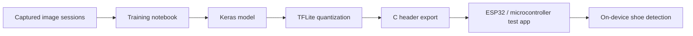

# Machine Learning for IoT Portfolio

Embedded machine-learning repository focused on deploying compact computer-vision models to IoT-style hardware workflows.

## Product Summary

This repository shows the path from model training to embedded inference. The main portfolio project is an image-based shoe/no-shoe detector that is trained, converted to TensorFlow Lite, exported into C headers, and prepared for embedded execution.

## Featured Project: Visual Object Detection on Embedded Hardware

Location: `project-1-visual-object-detectoion-vlipare-ctrl/`

The project includes:

- Training notebooks and model artifacts.
- Keras and TensorFlow Lite model outputs.
- Quantized `.tflite` model files.
- Generated C header files for embedded deployment.
- ESP/Arduino-style test code.
- Report and presentation artifacts.

## Architecture

## Repository Map

- `project-1-visual-object-detectoion-vlipare-ctrl/training/` - model training workflow
- `project-1-visual-object-detectoion-vlipare-ctrl/training_outputs/` - Keras, TFLite, and C-header artifacts
- `project-1-visual-object-detectoion-vlipare-ctrl/embedded/` - embedded deployment code
- `project-1-visual-object-detectoion-vlipare-ctrl/test_programs/` - image capture and TFLite test programs
- `Image_Recognition_Assignment/` - image-recognition assignment work
- `Imbalanced_Datasets_And_Regularization/` - imbalanced dataset and regularization experiments

## Results

The Keras and quantized TFLite outputs agree on the included validation examples in `training_outputs/keras_vs_tflite_results.csv`.

Example rows:

| True label | Keras prediction | TFLite prediction |
|---|---|---|
| Shoe | Shoe | Shoe |
| NoShoe | NoShoe | NoShoe |

## How To Run

1. Open the training notebook in `project-1-visual-object-detectoion-vlipare-ctrl/training/`.
2. Regenerate model outputs into `training_outputs/`.
3. Use the exported `.tflite` or `model_data.h` in the embedded test app.
4. Build/upload the embedded sketch from the corresponding `embedded/` or `test_programs/` folder.

## Screenshots And Demo

- Visual/report artifact: `project-1-visual-object-detectoion-vlipare-ctrl/Project 1 - Object Detection - Viprav Lipare.pdf`
- Recommended demo: show image capture, model prediction, and the Keras-vs-TFLite comparison table.

## What Employers Should Notice

- End-to-end ML system thinking: data collection, training, optimization, conversion, and deployment.
- Embedded constraints are part of the design, not an afterthought.
- The repo contains real deployment artifacts, not only notebooks.
